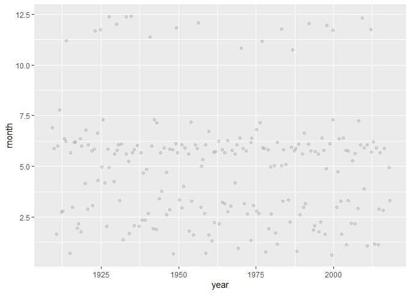
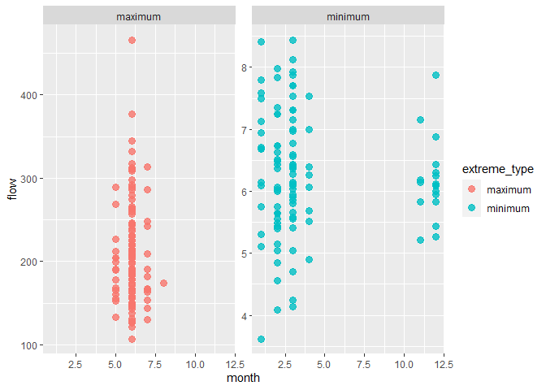
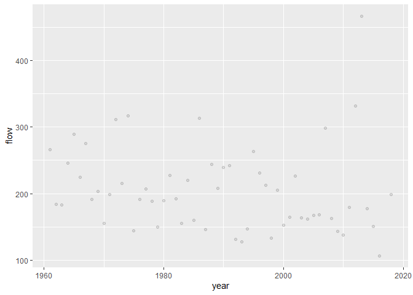
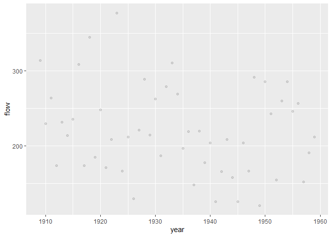
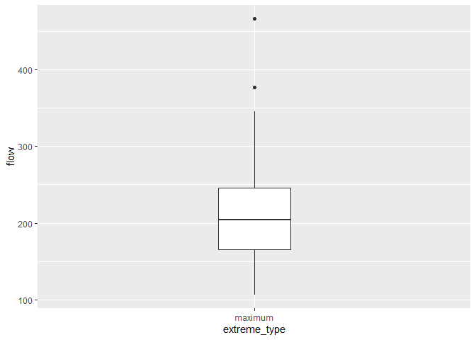
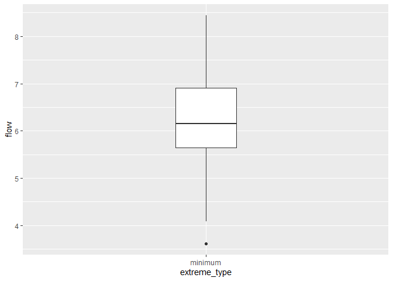

AKu_MiniAnalysis_1
================
Andrea_Ku
07 October 2021

# **Milestone 1- Mini Data Analysis Project**

The purpose of this mini data analysis is to learn how to work through a
data analysis while creating a clear markdown file.

Install and load the packages

``` r
#install.packages("devtools")
#devtools::install_github("UBC-MDS/datateachr")

library(datateachr)
library(tidyverse)
```

    ## -- Attaching packages --------------------------------------- tidyverse 1.3.1 --

    ## v ggplot2 3.3.5     v purrr   0.3.4
    ## v tibble  3.1.4     v dplyr   1.0.7
    ## v tidyr   1.1.3     v stringr 1.4.0
    ## v readr   2.0.1     v forcats 0.5.1

    ## -- Conflicts ------------------------------------------ tidyverse_conflicts() --
    ## x dplyr::filter() masks stats::filter()
    ## x dplyr::lag()    masks stats::lag()

# **Task 1- Choose your favorite dataset**

**1.1 Choose 4 of the datateachr packages that appeal to you**

1.  building_permits: Acquired courtesy of The City of Vancouver’s Open
    Data Portal. It currently has 20680 rows and 14 columns.

2.  flow_sample: Acquired courtesy of The Government of Canada’s
    Historical Hydrometric Database. It currently has 218 rows and 7
    columns.

3.  steam_games: steam_games: Acquired courtesy of Kaggle. It currently
    has 40833 rows and 21 columns.

4.  vancouver_trees: Acquired courtesy of The City of Vancouver’s Open
    Data Portal. It currently has 146611 rows and 20 columns

**1.2 Explore the dataset**

Explore **building_permits** dataset

##### The **building_permits** dataset has information about the building, including the location, the permit information, the contractor, and the intended use of the property.

What dataframe?

``` r
class(building_permits)
```

    ## [1] "spec_tbl_df" "tbl_df"      "tbl"         "data.frame"

What dimensions in the data frame?

``` r
dim(building_permits)
```

    ## [1] 20680    14

Print the data

``` r
glimpse(building_permits)
```

    ## Rows: 20,680
    ## Columns: 14
    ## $ permit_number               <chr> "BP-2016-02248", "BU468090", "DB-2016-0445~
    ## $ issue_date                  <date> 2017-02-01, 2017-02-01, 2017-02-01, 2017-~
    ## $ project_value               <dbl> 0, 0, 35000, 15000, 181178, 0, 15000, 0, 6~
    ## $ type_of_work                <chr> "Salvage and Abatement", "New Building", "~
    ## $ address                     <chr> "4378 W 9TH AVENUE, Vancouver, BC V6R 2C7"~
    ## $ project_description         <chr> NA, NA, NA, NA, NA, NA, NA, NA, NA, NA, NA~
    ## $ building_contractor         <chr> NA, NA, NA, "Mercury Contracting Ltd", "08~
    ## $ building_contractor_address <chr> NA, NA, NA, "88 W PENDER ST  \r\nUnit 2069~
    ## $ applicant                   <chr> "Raffaele & Associates DBA: Raffaele and A~
    ## $ applicant_address           <chr> "2642 East Hastings\r\nVancouver, BC  V5K ~
    ## $ property_use                <chr> "Dwelling Uses", "Dwelling Uses", "Dwellin~
    ## $ specific_use_category       <chr> "One-Family Dwelling", "Multiple Dwelling"~
    ## $ year                        <dbl> 2017, 2017, 2017, 2017, 2017, 2017, 2017, ~
    ## $ bi_id                       <dbl> 524, 535, 539, 541, 543, 546, 547, 548, 54~

Explore **flow_sample** dataset

##### The **flow_sample** dataset has information about the flow at a specific station over several decades, including information about the time that the data was collected.

What dataframe?

``` r
class(flow_sample)
```

    ## [1] "tbl_df"     "tbl"        "data.frame"

What dimensions in the data frame?

``` r
dim(flow_sample)
```

    ## [1] 218   7

Print the data

``` r
glimpse(flow_sample)
```

    ## Rows: 218
    ## Columns: 7
    ## $ station_id   <chr> "05BB001", "05BB001", "05BB001", "05BB001", "05BB001", "0~
    ## $ year         <dbl> 1909, 1910, 1911, 1912, 1913, 1914, 1915, 1916, 1917, 191~
    ## $ extreme_type <chr> "maximum", "maximum", "maximum", "maximum", "maximum", "m~
    ## $ month        <dbl> 7, 6, 6, 8, 6, 6, 6, 6, 6, 6, 6, 7, 6, 6, 6, 7, 5, 7, 6, ~
    ## $ day          <dbl> 7, 12, 14, 25, 11, 18, 27, 20, 17, 15, 22, 3, 9, 5, 14, 5~
    ## $ flow         <dbl> 314, 230, 264, 174, 232, 214, 236, 309, 174, 345, 185, 24~
    ## $ sym          <chr> NA, NA, NA, NA, NA, NA, NA, NA, NA, NA, NA, NA, NA, NA, N~

Explore **steam_games** dataset

What dataframe?

``` r
class(steam_games)
```

    ## [1] "spec_tbl_df" "tbl_df"      "tbl"         "data.frame"

What dimensions in the data frame?

``` r
dim(steam_games)
```

    ## [1] 40833    21

Print the data

``` r
glimpse(steam_games)
```

    ## Rows: 40,833
    ## Columns: 21
    ## $ id                       <dbl> 1, 2, 3, 4, 5, 6, 7, 8, 9, 10, 11, 12, 13, 14~
    ## $ url                      <chr> "https://store.steampowered.com/app/379720/DO~
    ## $ types                    <chr> "app", "app", "app", "app", "app", "bundle", ~
    ## $ name                     <chr> "DOOM", "PLAYERUNKNOWN'S BATTLEGROUNDS", "BAT~
    ## $ desc_snippet             <chr> "Now includes all three premium DLC packs (Un~
    ## $ recent_reviews           <chr> "Very Positive,(554),- 89% of the 554 user re~
    ## $ all_reviews              <chr> "Very Positive,(42,550),- 92% of the 42,550 u~
    ## $ release_date             <chr> "May 12, 2016", "Dec 21, 2017", "Apr 24, 2018~
    ## $ developer                <chr> "id Software", "PUBG Corporation", "Harebrain~
    ## $ publisher                <chr> "Bethesda Softworks,Bethesda Softworks", "PUB~
    ## $ popular_tags             <chr> "FPS,Gore,Action,Demons,Shooter,First-Person,~
    ## $ game_details             <chr> "Single-player,Multi-player,Co-op,Steam Achie~
    ## $ languages                <chr> "English,French,Italian,German,Spanish - Spai~
    ## $ achievements             <dbl> 54, 37, 128, NA, NA, NA, 51, 55, 34, 43, 72, ~
    ## $ genre                    <chr> "Action", "Action,Adventure,Massively Multipl~
    ## $ game_description         <chr> "About This Game Developed by id software, th~
    ## $ mature_content           <chr> NA, "Mature Content Description  The develope~
    ## $ minimum_requirements     <chr> "Minimum:,OS:,Windows 7/8.1/10 (64-bit versio~
    ## $ recommended_requirements <chr> "Recommended:,OS:,Windows 7/8.1/10 (64-bit ve~
    ## $ original_price           <dbl> 19.99, 29.99, 39.99, 44.99, 0.00, NA, 59.99, ~
    ## $ discount_price           <dbl> 14.99, NA, NA, NA, NA, 35.18, 70.42, 17.58, N~

Explore **vancouver_trees** dataset

##### The **vancouver_trees** dataset has information about the physical and identifing characteristics of the tree and the location of the tree within the city.

What dataframe?

``` r
class(vancouver_trees)
```

    ## [1] "tbl_df"     "tbl"        "data.frame"

What dimensions in the data frame?

``` r
dim(vancouver_trees)
```

    ## [1] 146611     20

How many rows is the data? To guage data complexity

Print the data

``` r
glimpse(vancouver_trees)
```

    ## Rows: 146,611
    ## Columns: 20
    ## $ tree_id            <dbl> 149556, 149563, 149579, 149590, 149604, 149616, 149~
    ## $ civic_number       <dbl> 494, 450, 4994, 858, 5032, 585, 4909, 4925, 4969, 7~
    ## $ std_street         <chr> "W 58TH AV", "W 58TH AV", "WINDSOR ST", "E 39TH AV"~
    ## $ genus_name         <chr> "ULMUS", "ZELKOVA", "STYRAX", "FRAXINUS", "ACER", "~
    ## $ species_name       <chr> "AMERICANA", "SERRATA", "JAPONICA", "AMERICANA", "C~
    ## $ cultivar_name      <chr> "BRANDON", NA, NA, "AUTUMN APPLAUSE", NA, "CHANTICL~
    ## $ common_name        <chr> "BRANDON ELM", "JAPANESE ZELKOVA", "JAPANESE SNOWBE~
    ## $ assigned           <chr> "N", "N", "N", "Y", "N", "N", "N", "N", "N", "N", "~
    ## $ root_barrier       <chr> "N", "N", "N", "N", "N", "N", "N", "N", "N", "N", "~
    ## $ plant_area         <chr> "N", "N", "4", "4", "4", "B", "6", "6", "3", "3", "~
    ## $ on_street_block    <dbl> 400, 400, 4900, 800, 5000, 500, 4900, 4900, 4900, 7~
    ## $ on_street          <chr> "W 58TH AV", "W 58TH AV", "WINDSOR ST", "E 39TH AV"~
    ## $ neighbourhood_name <chr> "MARPOLE", "MARPOLE", "KENSINGTON-CEDAR COTTAGE", "~
    ## $ street_side_name   <chr> "EVEN", "EVEN", "EVEN", "EVEN", "EVEN", "ODD", "ODD~
    ## $ height_range_id    <dbl> 2, 4, 3, 4, 2, 2, 3, 3, 2, 2, 2, 5, 3, 2, 2, 2, 2, ~
    ## $ diameter           <dbl> 10.00, 10.00, 4.00, 18.00, 9.00, 5.00, 15.00, 14.00~
    ## $ curb               <chr> "N", "N", "Y", "Y", "Y", "Y", "Y", "Y", "Y", "Y", "~
    ## $ date_planted       <date> 1999-01-13, 1996-05-31, 1993-11-22, 1996-04-29, 19~
    ## $ longitude          <dbl> -123.1161, -123.1147, -123.0846, -123.0870, -123.08~
    ## $ latitude           <dbl> 49.21776, 49.21776, 49.23938, 49.23469, 49.23894, 4~

**1.3 Narrow down to 2**

From the selected dataframes, I am most interested in the
vancouver_trees dataset and the flow_sample datasets. After reviewing
the data that each set contains, I found the flow_sample dataset to be
interesting, relevant, and familiar for me, as my interest is in
environmental studies. My previous projects looks at guage station data,
so the information provided in the flow_sample was more intuitive for me
to understand. Similarly, I also chose the vancouver_trees dataset
because I think tree identification and measurements are similar to the
kind of data I will be working with in my field. Data about trees also
interest me because I will likely continue to work with trees moving
forward into my career, so the vancouver_trees dataset is both familiar
and relevant for me.

**1.4 Potential research question with each dataset**

**Potential question for the flow_sample dataset:**

What is the relationship between month and flow? How do the flow
patterns vary each month?

**Potential question for the vancouver_trees dataset:**

How does the date that the tree was planted relate to the neighborhood?
Were the measured trees planted in the same neighborhood at the same
time, or were the planted in neighborhoods sporadically? What is the
distribution of diameters measured?

**Final Decision:** I’ve decided to use the flow_sample dataset for my
Mini Data Analysis. The flow_sample dataset is more straightforward for
me to understand, and is just as relevant for my future work in the
environmental sector.

**Task 2: Exploring your dataset**

**2.1 Dive deeper into your data**

1.  Plot the distribution of a numeric variable: Plot the distribution
    of when the data was taken to see if there were years or months that
    more data was taken than others. Use the jitter as geometry so we
    can better distinguish the distribution.

``` r
sample_dist <- ggplot(flow_sample) +
    geom_jitter(aes(x = year, y = month), alpha = 0.1)
print(sample_dist)
```

    ## Warning: Removed 2 rows containing missing values (geom_point).

<!-- -->

2.  Explore the relationship between 2 variables in a plot: Plot the
    minimum and maximum flows over months in seperate plots to see the
    range of flow within each month for each extreme. Facet the plot to
    seperate the minimum and maximum, so we can more effectively see the
    range of values

``` r
Extreme_Flow_Month <- ggplot(flow_sample,
                    aes(month, flow)) +
                    facet_wrap(~ extreme_type, scales = "free_y")+
 geom_point(aes(color = extreme_type),
            size = 3,
            alpha = 0.8)
            guides(color = FALSE)
```

    ## Warning: `guides(<scale> = FALSE)` is deprecated. Please use `guides(<scale> =
    ## "none")` instead.

    ## $colour
    ## [1] "none"
    ## 
    ## attr(,"class")
    ## [1] "guides"

``` r
print(Extreme_Flow_Month)
```

    ## Warning: Removed 2 rows containing missing values (geom_point).

<!-- -->

3.  Filter observations according to time, where we can look at recent
    data starting in 1960, and before 1960. Then plot the observations
    to see if flow has changed over the century. Filter for recent
    years, from 1960 till present

``` r
MaxSince_1960 <- flow_sample %>%
  filter(year > 1960, extreme_type == "maximum")
print(MaxSince_1960)
```

    ## # A tibble: 57 x 7
    ##    station_id  year extreme_type month   day  flow sym  
    ##    <chr>      <dbl> <chr>        <dbl> <dbl> <dbl> <chr>
    ##  1 05BB001     1961 maximum          6     7   266 <NA> 
    ##  2 05BB001     1962 maximum          6    26   184 <NA> 
    ##  3 05BB001     1963 maximum          6    19   183 <NA> 
    ##  4 05BB001     1964 maximum          6    14   246 <NA> 
    ##  5 05BB001     1965 maximum          6    19   289 <NA> 
    ##  6 05BB001     1966 maximum          6     1   225 <NA> 
    ##  7 05BB001     1967 maximum          6    22   275 <NA> 
    ##  8 05BB001     1968 maximum          6    27   191 <NA> 
    ##  9 05BB001     1969 maximum          6     6   203 <NA> 
    ## 10 05BB001     1970 maximum          6     5   155 <NA> 
    ## # ... with 47 more rows

Plot the flow for years 1960-present

``` r
MaxSince_1960_plot <- ggplot(MaxSince_1960) +
    geom_point(aes(x = year, y = flow), alpha = 0.1)
print(MaxSince_1960_plot)
```

<!-- -->

Filter for historical years, since before 1960

``` r
MaxBefore_1960 <- flow_sample %>%
  filter(year < 1960, extreme_type == "maximum")
print(MaxBefore_1960)
```

    ## # A tibble: 51 x 7
    ##    station_id  year extreme_type month   day  flow sym  
    ##    <chr>      <dbl> <chr>        <dbl> <dbl> <dbl> <chr>
    ##  1 05BB001     1909 maximum          7     7   314 <NA> 
    ##  2 05BB001     1910 maximum          6    12   230 <NA> 
    ##  3 05BB001     1911 maximum          6    14   264 <NA> 
    ##  4 05BB001     1912 maximum          8    25   174 <NA> 
    ##  5 05BB001     1913 maximum          6    11   232 <NA> 
    ##  6 05BB001     1914 maximum          6    18   214 <NA> 
    ##  7 05BB001     1915 maximum          6    27   236 <NA> 
    ##  8 05BB001     1916 maximum          6    20   309 <NA> 
    ##  9 05BB001     1917 maximum          6    17   174 <NA> 
    ## 10 05BB001     1918 maximum          6    15   345 <NA> 
    ## # ... with 41 more rows

Plot the flow for historical years, since before 1960

``` r
MaxBefore_1960_plot <- ggplot(MaxBefore_1960) +
    geom_point(aes(x = year, y = flow), alpha = 0.1)
print(MaxBefore_1960_plot)
```

<!-- -->

4.  Plot the flow in boxplots to see the distribution within minimum and
    maximum flows Filter by Maximum Flow

``` r
Max_only <- flow_sample %>%
  filter(extreme_type == "maximum")
print(Max_only)
```

    ## # A tibble: 109 x 7
    ##    station_id  year extreme_type month   day  flow sym  
    ##    <chr>      <dbl> <chr>        <dbl> <dbl> <dbl> <chr>
    ##  1 05BB001     1909 maximum          7     7   314 <NA> 
    ##  2 05BB001     1910 maximum          6    12   230 <NA> 
    ##  3 05BB001     1911 maximum          6    14   264 <NA> 
    ##  4 05BB001     1912 maximum          8    25   174 <NA> 
    ##  5 05BB001     1913 maximum          6    11   232 <NA> 
    ##  6 05BB001     1914 maximum          6    18   214 <NA> 
    ##  7 05BB001     1915 maximum          6    27   236 <NA> 
    ##  8 05BB001     1916 maximum          6    20   309 <NA> 
    ##  9 05BB001     1917 maximum          6    17   174 <NA> 
    ## 10 05BB001     1918 maximum          6    15   345 <NA> 
    ## # ... with 99 more rows

Plot the distribution of Max flow by Box plot

``` r
Max_Box <- ggplot(Max_only, aes(extreme_type, flow)) + 
    geom_boxplot(width = 0.2)
print(Max_Box)
```

<!-- -->

Filter by minimum flow

``` r
Min_only <- flow_sample %>%
  filter(extreme_type == "minimum")
print(Min_only)
```

    ## # A tibble: 109 x 7
    ##    station_id  year extreme_type month   day  flow sym  
    ##    <chr>      <dbl> <chr>        <dbl> <dbl> <dbl> <chr>
    ##  1 05BB001     1909 minimum         NA    NA NA    <NA> 
    ##  2 05BB001     1910 minimum         NA    NA NA    <NA> 
    ##  3 05BB001     1911 minimum          2    27  5.75 <NA> 
    ##  4 05BB001     1912 minimum          3    14  5.8  <NA> 
    ##  5 05BB001     1913 minimum          3    18  6.12 B    
    ##  6 05BB001     1914 minimum         11    17  7.16 <NA> 
    ##  7 05BB001     1915 minimum          1    27  6.94 <NA> 
    ##  8 05BB001     1916 minimum          3     2  6.97 B    
    ##  9 05BB001     1917 minimum          2    23  6.06 B    
    ## 10 05BB001     1918 minimum          2    20  6.03 B    
    ## # ... with 99 more rows

Plot the distribution of Min flow by box plot

``` r
Min_Box <- ggplot(Min_only, aes(extreme_type, flow)) + 
    geom_boxplot(width = 0.2)
print(Min_Box)
```

    ## Warning: Removed 2 rows containing non-finite values (stat_boxplot).

<!-- -->

**2.2 Explain the exercise in relation to flow_samples**

**1. For plotting the numeric values:**

I will plot the distribution of the data over each month and year the
data was taken to see when the most or least data was collected. This
will help me determine the range of time that that data was collected,
which would help me better understand the data collection and how it may
influence my analysis. This plot answers questions like, “Were there
equal number of samples collected each month, and each year?” and “Were
there more samples collected in the summer or the winter of each year?”
The answers to these will help me better analyze the data in case I need
to transform or reduce the data into averages, and recognize when the
data might be skewed due to fewer samples.

**2. For exploring the relationship between 2 variables in a plot:**

I thought it would be interesting to distinguish the range of flow for
both the minimum and maximum extreme over the course of the year.This
will help me determine the range of time that that data was collected in
the dataset, and get a better sense of the environment I am working in
and when the flow seasons are. According to the plot, it seem like month
5-7 have peak flow, which is May, June, and July. This is to show 1)
which month are there minimums and maximum, and 2) within each extreme
type, what is the range in the extreme? What is the range of the minimum
flow? And what is the range of the maximum flow? Are there months where
the maximum flow have a greater range? When are the months where the
minimum flows have the least range? These questions can help be
explained by exploring the relationship in these variables.

**3. For filtering the observations according to time**

The amount of flow may have changed over time, as the climate, land use,
or development has changed. Filtering helps to divide the data into
different categories that can be used to distinguish if the flow has
experienced any changed over the century. Since this data starts in
1909, I thought that dividing the data in half by time would be
appropriate to see general trends in flow change. Therefore, historical
data would be considered before 1960, and recent data is considered
since 1960. The data is filtered by these parameters, then plotted so I
can see the range in values over the years. This filtering and plotting
method answers questions related to change over time. How does the range
of flow since before 1960 compare to the range of flow from 1960 to
present day? Has flow generally decreased over time?

**4. For creating boxplots of minimum and maximum flows**

Within each extreme type, there is variability in the data. The box plot
is helpful for plotting the variability in the data to show where most
of the minimum values lie within the dataset, and likewise for the
maximum values. This boxplot helps identify any flow values that are not
within the normal range for minimum and maximum values. So if there were
any flow values that were abnormally high, I could identify them more
easily and either investigate or exclude them from my analysis.

# **Task 3: Write Research Questions**

1.  How does the range of flow since before 1960 compare to the range of
    flow from 1960 to present day? Has flow generally decreased over
    time?

2.  Within each extreme type, how does the pattern of flow change over
    the course of the month? How does the flow in the first few days of
    the month compare to the last days of the month?

3.  Which months are there minimums and maximum? Does the flow
    correspond to seasons?

4.  Within each extreme type, what is the range in the extreme? Are
    there any values that are outside the normal distribution of the
    data? Do these values lie within certain time frames?

# 
