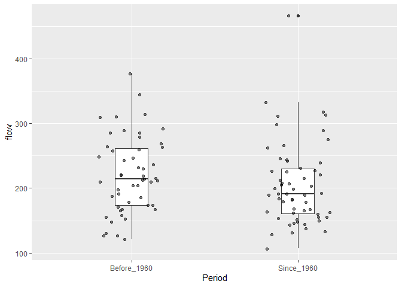
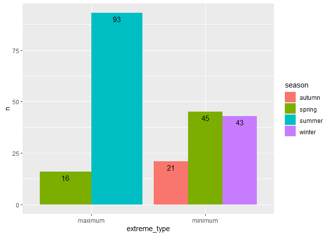
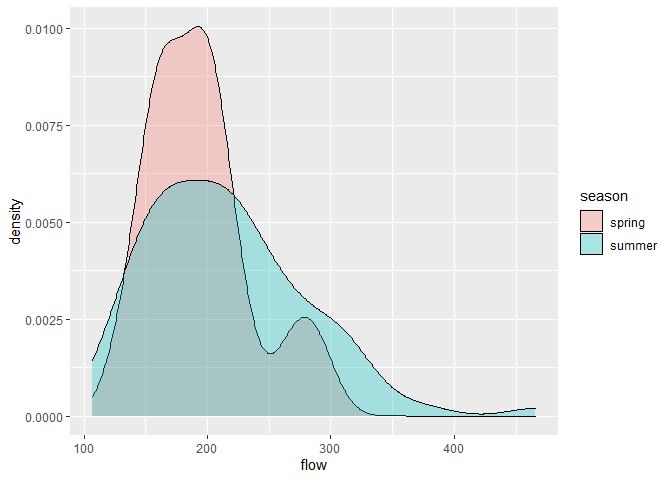
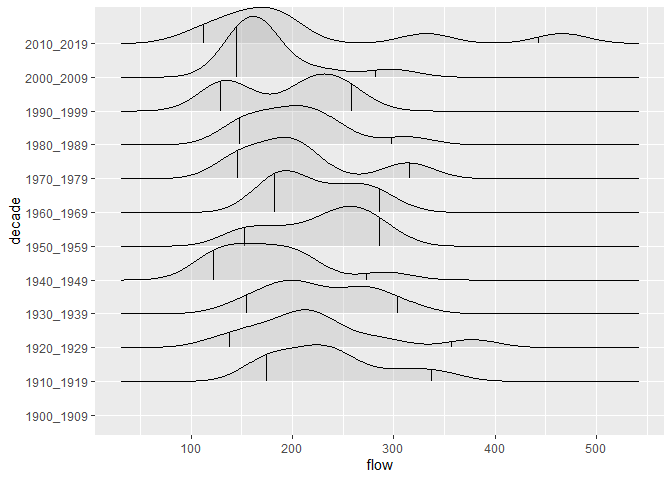

Mini Data Analysis Milestone 2
================

# Welcome back to Mini Data Analysis Part 2!

Begin by loading data and the tidyverse package below:

``` r
library(datateachr) # <- might contain the data you picked!
library(tidyverse)
library(ggplot2)
library(ggridges)
```

# Task 1: Process and summarize your data

### 1.1 Research Questions:

Note: The research questions were slightly modified from Milestone 1 to
suit the scope of Milestone 2.

1.  How does the range of maximum flow since before 1960 compare to the
    range of flow from 1960 to present day?

2.  Do minimum and maximum extreme flow types correspond to specific
    seasons?

3.  Within the maximum extreme type, how does the pattern of flow change
    over the seasons?

4.  Are there changes in maximum flow patterns by decade?

### 1.2 Summarize and Graph

*1. How does the range of maximum flow since before 1960 compare to the
range of flow from 1960 to present day?*

#### Summarizing

##### Create a new column to seperate data for years prior to 1960 and since 1960 for maximum extremes.

``` r
flow_sample_PeriodMax <- flow_sample %>% 
  filter(extreme_type == 'maximum') %>%  
  mutate(Period = case_when(year > 1959 ~ "Since_1960", TRUE ~ "Before_1960"))
print(flow_sample_PeriodMax)
```

    ## # A tibble: 109 x 8
    ##    station_id  year extreme_type month   day  flow sym   Period     
    ##    <chr>      <dbl> <chr>        <dbl> <dbl> <dbl> <chr> <chr>      
    ##  1 05BB001     1909 maximum          7     7   314 <NA>  Before_1960
    ##  2 05BB001     1910 maximum          6    12   230 <NA>  Before_1960
    ##  3 05BB001     1911 maximum          6    14   264 <NA>  Before_1960
    ##  4 05BB001     1912 maximum          8    25   174 <NA>  Before_1960
    ##  5 05BB001     1913 maximum          6    11   232 <NA>  Before_1960
    ##  6 05BB001     1914 maximum          6    18   214 <NA>  Before_1960
    ##  7 05BB001     1915 maximum          6    27   236 <NA>  Before_1960
    ##  8 05BB001     1916 maximum          6    20   309 <NA>  Before_1960
    ##  9 05BB001     1917 maximum          6    17   174 <NA>  Before_1960
    ## 10 05BB001     1918 maximum          6    15   345 <NA>  Before_1960
    ## # ... with 99 more rows

##### Compute the range, mean, median, and standard deviation across the groups of the categorical variable, Period (since\_ or before_1960), from your data.

###### This task helps answer the research question by providing the range of values for the two different time periods, and allows us to easily quantify the change in maximum flow over time.

``` r
FlowPeriod_summaryMax <- flow_sample_PeriodMax %>% 
              group_by(Period) %>%
  summarise(range = range(flow),
            mean = mean(flow),
            min = min(flow),
            max = max(flow),
            median = median(flow),
            stdDev = sd(flow))
```

    ## `summarise()` has grouped output by 'Period'. You can override using the `.groups` argument.

``` r
print(FlowPeriod_summaryMax)
```

    ## # A tibble: 4 x 7
    ## # Groups:   Period [2]
    ##   Period      range  mean   min   max median stdDev
    ##   <chr>       <dbl> <dbl> <dbl> <dbl>  <dbl>  <dbl>
    ## 1 Before_1960   121  221.   121   377    214   59.0
    ## 2 Before_1960   377  221.   121   377    214   59.0
    ## 3 Since_1960    107  205.   107   466    191   63.5
    ## 4 Since_1960    466  205.   107   466    191   63.5

#### Graphing

##### Create a graph out of summarized variables that has at least two geom layers

###### For this graph, it makes more sense to create the graph from all the variables to show the summarized variables in a boxplot. Previously, the maximum flow values were quantified using values in a table, which is valuable for comparing actual numbers. Now, the summary statistics are displayed in a graph, which is more helpful for seeing general trends in the two categories. As you can see in the boxplot, the flow summary statistics from before 1960 seems generally higher than the flow since 1960, suggesting that the flow has decreased over time.

``` r
Max_Box <- ggplot(flow_sample_PeriodMax, aes(Period, flow)) + 
    geom_boxplot(width = 0.2)+
    geom_jitter(alpha = 0.5, width = 0.2)
print(Max_Box)
```

<!-- -->

*2. Do minimum and maximum extreme flow types correspond to specific
seasons?*

#### Summarizing

##### Compute the number of observations for each extreme type by season.

###### Seasons align with the months for the northern hemisphere, where winter months are December - January, and Summer months are June - August.

``` r
# Create new column for each season
flow_sample_Seasons <- flow_sample %>% 
   mutate(season = case_when(month < 3 ~ "winter", month < 6 ~ "spring", month < 9 ~ "summer", TRUE ~ "autumn"))
print(flow_sample_Seasons)
```

    ## # A tibble: 218 x 8
    ##    station_id  year extreme_type month   day  flow sym   season
    ##    <chr>      <dbl> <chr>        <dbl> <dbl> <dbl> <chr> <chr> 
    ##  1 05BB001     1909 maximum          7     7   314 <NA>  summer
    ##  2 05BB001     1910 maximum          6    12   230 <NA>  summer
    ##  3 05BB001     1911 maximum          6    14   264 <NA>  summer
    ##  4 05BB001     1912 maximum          8    25   174 <NA>  summer
    ##  5 05BB001     1913 maximum          6    11   232 <NA>  summer
    ##  6 05BB001     1914 maximum          6    18   214 <NA>  summer
    ##  7 05BB001     1915 maximum          6    27   236 <NA>  summer
    ##  8 05BB001     1916 maximum          6    20   309 <NA>  summer
    ##  9 05BB001     1917 maximum          6    17   174 <NA>  summer
    ## 10 05BB001     1918 maximum          6    15   345 <NA>  summer
    ## # ... with 208 more rows

##### The observations of each extreme type is tallied by season, which identifies how many times each extreme observation occured in each season.

###### This information addresses the research question by highlighting whether minimum or maximum extremes are noted in specific seasons. For example, maximum extremes were only observed in spring and summer, suggesting that spring and summer have heavier water flow than winter and autumn. With this information, we know that maximum extreme flow values do coorespond to specific seasons- spring and summer. Alternatively, the minimum extreme type is observed in autumn, spring, and winter. Therefore, we know that minimum flows are not observed in the summer.

``` r
# Count the observations of each extreme type by season
nExtremeType <-  flow_sample_Seasons %>%
        group_by(extreme_type, season) %>%
        tally()
print(nExtremeType)
```

    ## # A tibble: 5 x 3
    ## # Groups:   extreme_type [2]
    ##   extreme_type season     n
    ##   <chr>        <chr>  <int>
    ## 1 maximum      spring    16
    ## 2 maximum      summer    93
    ## 3 minimum      autumn    21
    ## 4 minimum      spring    45
    ## 5 minimum      winter    43

#### Graphing

##### Create a graph out of summarized variables that has at least two geom layers.

###### The chart uses the summarized counts for minimum and maximum extremes for each season, which quantifies how many times an extreme observation is observed in the seasons. The research question is addressed in the graph, as the maximum observations are only seen in summer and spring months, where the large majority of maximum values are from the summer months. Alternatively, the majority of minimum values are observed in winter months, with spring having the second most minimum observations. Therefore, from the graph, you can clearly see that maximum and minimum extremes do share a relationship with the seasons.

``` r
# Graph the count (n) for each extreme type, per season
nChart <- ggplot(data = nExtremeType, aes(x = extreme_type)) + 
    geom_col(aes(x= extreme_type, y = n, fill = season), position = "dodge") +
    geom_text(aes(y = n, label = n, group = season),
    colour = "black", size = 4,
    vjust = 1.5, position= position_dodge(0.9))
print(nChart)
```

<!-- -->

*3. Within the maximum extreme type, how does the pattern of flow change
over the seasons?*

#### Summarizing

##### Based on two categorical variables- Maximum extreme type and seasons, calculate two range, mean, median, and standard deviation.

###### The research question is addressed when running the summary statistics by season and by extreme type, as the output table describes the quantitative values of maximum flow in the two seasons that maximum flow occurs- in the spring and summer.

###### From the calculated statistics, you can see how the median and mean of the maximum flow is greater in the summer, suggesting overall greater flow during summer months. However, you will also notice that the range and the standard deviation is also greater in the summer months, which indicates greater variation of flow, meaning that there likely are greater variations in weather patterns at this station during the summer, and more consistent flow patterns during the spring.

``` r
# Calculate Statistics
FlowSeasons_summaryMax <- flow_sample_Seasons %>% 
  filter(extreme_type == 'maximum') %>% 
              group_by(season) %>%
  summarise(range = range(flow),
            mean = mean(flow),
            min = min(flow),
            max = max(flow),
            median = median(flow),
            stdDev = sd(flow))
```

    ## `summarise()` has grouped output by 'season'. You can override using the `.groups` argument.

``` r
print(FlowSeasons_summaryMax)
```

    ## # A tibble: 4 x 7
    ## # Groups:   season [2]
    ##   season range  mean   min   max median stdDev
    ##   <chr>  <dbl> <dbl> <dbl> <dbl>  <dbl>  <dbl>
    ## 1 spring   133  194.   133   289   190.   41.8
    ## 2 spring   289  194.   133   289   190.   41.8
    ## 3 summer   107  215.   107   466   209    64.1
    ## 4 summer   466  215.   107   466   209    64.1

#### Graphing

##### Make a graph where it makes sense to customize the alpha transparency.

###### The density graph is useful for describing the patterns in maximum flow over the season, as you are able to observe the distribution of flow in each season. By observing the graph, the spring months seem to have a higher density of flow between a narrower range of flow measurements, while the summer months seem to have a wider range of flow values.

###### The alpha transparency in this graph is helpful to when comparing the density of flow patterns over the summer and spring seasons, where there are maximum flow values. Without the alpha transparency, it would be difficult to see the overlap and curavture of the graph for each season.

``` r
#Filter by Maximum only, since we only want to know how maximum flow changes over the seasons
flow_sample_SeasonsMax <- flow_sample_Seasons %>% 
  filter(extreme_type == 'maximum')
print(flow_sample_SeasonsMax)
```

    ## # A tibble: 109 x 8
    ##    station_id  year extreme_type month   day  flow sym   season
    ##    <chr>      <dbl> <chr>        <dbl> <dbl> <dbl> <chr> <chr> 
    ##  1 05BB001     1909 maximum          7     7   314 <NA>  summer
    ##  2 05BB001     1910 maximum          6    12   230 <NA>  summer
    ##  3 05BB001     1911 maximum          6    14   264 <NA>  summer
    ##  4 05BB001     1912 maximum          8    25   174 <NA>  summer
    ##  5 05BB001     1913 maximum          6    11   232 <NA>  summer
    ##  6 05BB001     1914 maximum          6    18   214 <NA>  summer
    ##  7 05BB001     1915 maximum          6    27   236 <NA>  summer
    ##  8 05BB001     1916 maximum          6    20   309 <NA>  summer
    ##  9 05BB001     1917 maximum          6    17   174 <NA>  summer
    ## 10 05BB001     1918 maximum          6    15   345 <NA>  summer
    ## # ... with 99 more rows

``` r
# Plot the density graph for maximum flow over the season
Season_Density <- ggplot(flow_sample_SeasonsMax, aes(x = flow)) +
    geom_density(aes(fill = season), alpha =0.3)
print(Season_Density)
```

<!-- -->

*4. Are there changes in maximum flow patterns by decade? *

#### Summarizing

##### Create a decade variables to categorize the flow values by decade for at least the past 30 years.

###### By sorting the years into individual decades, we can evaluate how the overall flow patterns have changed by comparing the values in each decade.

``` r
# Create a new column with at least the past 30 years categorized into decades
flow_sample_decade <- flow_sample_Seasons %>% 
    filter(extreme_type == 'maximum') %>%  # Only want maximum flow values
  mutate(decade = case_when(year > 2009 ~ "2010_2019",
                            year > 1999 ~ "2000_2009",
                            year > 1989 ~ "1990_1999",
                            year > 1979 ~ "1980_1989",
                            year > 1969 ~ "1970_1979",
                            year > 1959 ~ "1960_1969",
                            year > 1949 ~ "1950_1959",
                            year > 1939 ~ "1940_1949",
                            year > 1929 ~ "1930_1939",
                            year > 1919 ~ "1920_1929",
                            year > 1909 ~ "1910_1919",
                            year > 1899 ~ "1900_1909",
                            ))
print(flow_sample_decade)
```

    ## # A tibble: 109 x 9
    ##    station_id  year extreme_type month   day  flow sym   season decade   
    ##    <chr>      <dbl> <chr>        <dbl> <dbl> <dbl> <chr> <chr>  <chr>    
    ##  1 05BB001     1909 maximum          7     7   314 <NA>  summer 1900_1909
    ##  2 05BB001     1910 maximum          6    12   230 <NA>  summer 1910_1919
    ##  3 05BB001     1911 maximum          6    14   264 <NA>  summer 1910_1919
    ##  4 05BB001     1912 maximum          8    25   174 <NA>  summer 1910_1919
    ##  5 05BB001     1913 maximum          6    11   232 <NA>  summer 1910_1919
    ##  6 05BB001     1914 maximum          6    18   214 <NA>  summer 1910_1919
    ##  7 05BB001     1915 maximum          6    27   236 <NA>  summer 1910_1919
    ##  8 05BB001     1916 maximum          6    20   309 <NA>  summer 1910_1919
    ##  9 05BB001     1917 maximum          6    17   174 <NA>  summer 1910_1919
    ## 10 05BB001     1918 maximum          6    15   345 <NA>  summer 1910_1919
    ## # ... with 99 more rows

#### Graphing

##### Make a graph where it makes sense to customize the alpha transparency.

###### To see if there are changes in the maximum flow pattern by decade, the density ridges graph shows the range of flow values over time. I added quantile metrics so the data is easier to compare and contrast the maximum flow patterns between the decades.

###### The alpha transparency helps visualize the graph and the quantiles, as it focuses the graph on the dark lines, and helps display any quantile lines that overlap with the ridge graph shadowing.

``` r
# Visualize the flow pattern between each recent decade
chart_decade_flowpatterns <- flow_sample_decade %>% 
   ggplot(aes(flow, decade)) +
 stat_density_ridges(quantile_lines = TRUE, quantiles = c(0.025, 0.975), alpha = 0.3) #Add quantiles
print(chart_decade_flowpatterns)
```

    ## Picking joint bandwidth of 25.3

<!-- -->

### 1.3 Results and Review of research questions

Based on the operations, I have answered all of my research questions,
but each question can be expanded and researched more thoroughly. For
example, in question 4, “Are there changes in maximum flow patterns by
decade?” the answer could also be investigated by using summary
statistics by calculating the mean, range, and standard deviation for
each decade. Furthermore, for some of the questions, I only asked about
the maximum extreme type. To provide a more comprehensive review of the
data, I could also explore the minimum extreme type. Rather than my
research questions being refined, I think expanding my investigation
would yield interesting results, particularly in regard to exploring the
data for minimum flows.

The research questions that are yielding the most interesting results
include question 1 and 2: 1) How does the range of maximum flow since
before 1960 compare to the range of flow from 1960 to present day? and
2) Do minimum and maximum extreme flow types correspond to specific
seasons? For the range of maximum flow from before 1960 compared to 1960
to present day, I found that the flow summary statistics from before
1960 seems generally higher than the flow since 1960, suggesting that
the flow has decreased over time. Reasons for the observed change in
summary statistics for the flow values could range from a variety of
environmental or anthropocentric causes that would be interesting to
investigate. Furthermore, for question 2, it was interesting to know
that the minimum and maximum flow types do correspond to seasons. The
maximum values correspond to spring and summer seasons, while the
minimum values correspond to spring, autumn, and winter seasons. Since
the station location that collected this data is unknown to me, knowing
that the flow changes with the seasons helps me better understand
potential locations of the station, and the subsequent environment that
influence the flow in that region.

# Task 2: Tidy your data

### 2.1 Is flow_sample tidy?

Flow_sample data set is tidy because each column is a variable:
station_id, year, month, day, flow, and extreme_type. Within each row of
the data set, there is an observation from the water gauge that shows
when the data was collected and what the flow rate was at that
observation. Furthermore, each cell is a single value that identifies
the observation for each variable. Each cell only contains one value,
and that value is reflective of both the information from the
observation, and the variable from the column header. The cell does not
contain more than 1 value. Since the data set matches all 3 criteria, I
believe the flow_sample data set is tidy.

### 2.2 Untidy and Tidy Data

Since the flow_sample data set is tidy, I will untidy it.

Untidy the table to categorize each flow measurement by the extreme_type
that the data was categorized as. The reason I have untidy-ed the data
set in this manner is to have separate the maximum and minimum flow
values, so we can more easily distinguish see which flow values are
considered in the individual extreme types.

``` r
# Data set before untidy
head(flow_sample)
```

    ## # A tibble: 6 x 7
    ##   station_id  year extreme_type month   day  flow sym  
    ##   <chr>      <dbl> <chr>        <dbl> <dbl> <dbl> <chr>
    ## 1 05BB001     1909 maximum          7     7   314 <NA> 
    ## 2 05BB001     1910 maximum          6    12   230 <NA> 
    ## 3 05BB001     1911 maximum          6    14   264 <NA> 
    ## 4 05BB001     1912 maximum          8    25   174 <NA> 
    ## 5 05BB001     1913 maximum          6    11   232 <NA> 
    ## 6 05BB001     1914 maximum          6    18   214 <NA>

``` r
# Expand the extreme types into separate columns
untidy <- flow_sample %>% 
  pivot_wider(names_from = extreme_type, values_from = flow)

# Data set after untidy
head(untidy)
```

    ## # A tibble: 6 x 7
    ##   station_id  year month   day sym   maximum minimum
    ##   <chr>      <dbl> <dbl> <dbl> <chr>   <dbl>   <dbl>
    ## 1 05BB001     1909     7     7 <NA>      314      NA
    ## 2 05BB001     1910     6    12 <NA>      230      NA
    ## 3 05BB001     1911     6    14 <NA>      264      NA
    ## 4 05BB001     1912     8    25 <NA>      174      NA
    ## 5 05BB001     1913     6    11 <NA>      232      NA
    ## 6 05BB001     1914     6    18 <NA>      214      NA

Now, I will re-tidy the data set to make the minimum and maximum
variable entries into one variable named “extreme_type”

``` r
# Merge the Maximum and Minimum columns into one variable named Extreme Type
tidy <- untidy %>% 
  pivot_longer(cols = c(-station_id, -year, -month, -day, -sym), 
               names_to = "extreme_type", 
               values_to = "flow")

# Data set after re-tidy
head(tidy)
```

    ## # A tibble: 6 x 7
    ##   station_id  year month   day sym   extreme_type  flow
    ##   <chr>      <dbl> <dbl> <dbl> <chr> <chr>        <dbl>
    ## 1 05BB001     1909     7     7 <NA>  maximum        314
    ## 2 05BB001     1909     7     7 <NA>  minimum         NA
    ## 3 05BB001     1910     6    12 <NA>  maximum        230
    ## 4 05BB001     1910     6    12 <NA>  minimum         NA
    ## 5 05BB001     1911     6    14 <NA>  maximum        264
    ## 6 05BB001     1911     6    14 <NA>  minimum         NA

### 2.3 Choose questions for Milestone 3

Questions for Milestone 3 are:

1.  How does the pattern of flow change over the seasons?
2.  Are there changes in flow patterns by decade?

Question 1 is modified from Milestone 2 (this milestone’s) Question #3,
as I plan to broaden my research to also include investigation of
minimum flow patterns over the seasons. To gain a more comprehensive
view of the data and how the flow changes over time or seasonal
patterns, I should consider both maximum and minimum flows. Therefore, I
have chosen to continue with this question to work on the patterns seen
in minimum flow values.

Question 2 is directly from the 4th question in Milestone 2, but without
the specification of maximum flow values. This question is broad enough
to continue working on finding patterns within the data and calculating
more summary statistics within and between each decade of flow, and for
each extreme type.

The version of data I will be using will include new columns for decade
and season. Since I have already performed the operations for maximum
flow values, I will now filter for minimum values.

``` r
flow_sample_MDA3 <- flow_sample %>% 
   select(station_id, year, extreme_type, month, day, flow) %>%
   filter(extreme_type == 'minimum') %>%
   mutate(season = case_when(month < 3 ~ "winter",
                                 month < 6 ~ "spring",
                                 month < 9 ~ "summer",
                                 month < 12 ~ "autumn",
                                 TRUE ~ "winter")) %>%
   mutate(decade = case_when(year > 2009 ~ "2010_2019",
                            year > 1999 ~ "2000_2009",
                            year > 1989 ~ "1990_1999",
                            year > 1979 ~ "1980_1989",
                            year > 1969 ~ "1970_1979",
                            year > 1959 ~ "1960_1969",
                            year > 1949 ~ "1950_1959",
                            year > 1939 ~ "1940_1949",
                            year > 1929 ~ "1930_1939",
                            year > 1919 ~ "1920_1929",
                            year > 1909 ~ "1910_1919",
                            year > 1899 ~ "1900_1909"))
print(flow_sample_MDA3)
```

    ## # A tibble: 109 x 8
    ##    station_id  year extreme_type month   day  flow season decade   
    ##    <chr>      <dbl> <chr>        <dbl> <dbl> <dbl> <chr>  <chr>    
    ##  1 05BB001     1909 minimum         NA    NA NA    winter 1900_1909
    ##  2 05BB001     1910 minimum         NA    NA NA    winter 1910_1919
    ##  3 05BB001     1911 minimum          2    27  5.75 winter 1910_1919
    ##  4 05BB001     1912 minimum          3    14  5.8  spring 1910_1919
    ##  5 05BB001     1913 minimum          3    18  6.12 spring 1910_1919
    ##  6 05BB001     1914 minimum         11    17  7.16 autumn 1910_1919
    ##  7 05BB001     1915 minimum          1    27  6.94 winter 1910_1919
    ##  8 05BB001     1916 minimum          3     2  6.97 spring 1910_1919
    ##  9 05BB001     1917 minimum          2    23  6.06 winter 1910_1919
    ## 10 05BB001     1918 minimum          2    20  6.03 winter 1910_1919
    ## # ... with 99 more rows
