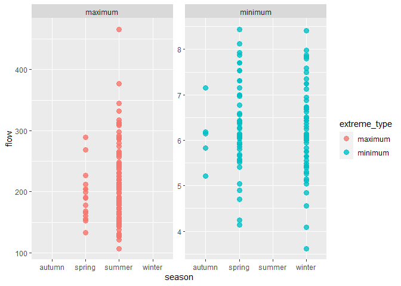
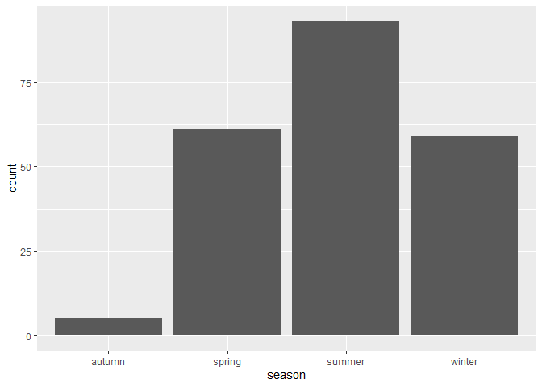
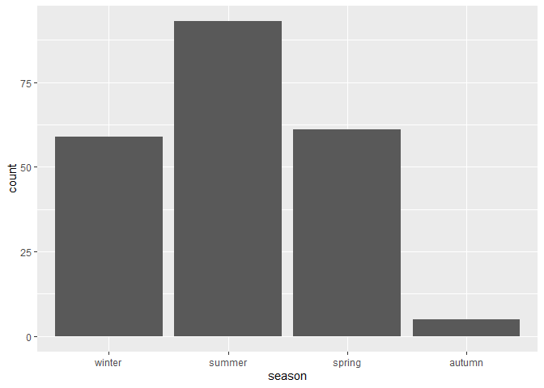
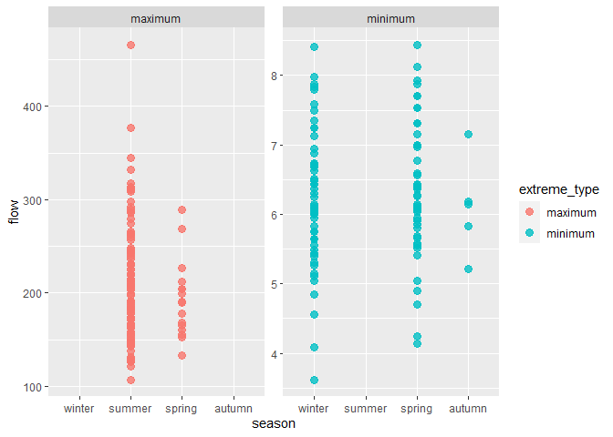
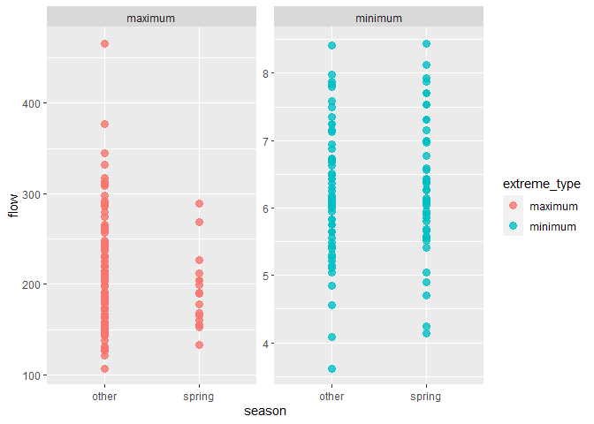

Mini Data Analysis Deliverable 3
================
Andrea_Ku
10/24/2021

# Welcome to your last milestone in your mini data analysis project!

# Setup

Begin by loading your data and the tidyverse package below:

``` r
library(datateachr) # <- might contain the data you picked!
library(tidyverse)
library(broom)
```

From Milestone 2, my two research questions were:

1.  How does the pattern of flow change over the seasons?
2.  Are there changes in flow patterns by decade?

# Exercise 1: Special Data Types

### The modified plot from Milestone 1 shows the range of flow values for minimum and maximum extremes for each season.

``` r
# From Milestone 2: Create a new column for each season
flow_sample_Seasons <- flow_sample %>% 
   mutate(season = case_when(month < 3 ~ "winter",
                                 month < 6 ~ "spring",
                                 month < 9 ~ "summer",
                                 month < 12 ~ "autumn",
                                 TRUE ~ "winter"))
print(flow_sample_Seasons)
```

    ## # A tibble: 218 x 8
    ##    station_id  year extreme_type month   day  flow sym   season
    ##    <chr>      <dbl> <chr>        <dbl> <dbl> <dbl> <chr> <chr> 
    ##  1 05BB001     1909 maximum          7     7   314 <NA>  summer
    ##  2 05BB001     1910 maximum          6    12   230 <NA>  summer
    ##  3 05BB001     1911 maximum          6    14   264 <NA>  summer
    ##  4 05BB001     1912 maximum          8    25   174 <NA>  summer
    ##  5 05BB001     1913 maximum          6    11   232 <NA>  summer
    ##  6 05BB001     1914 maximum          6    18   214 <NA>  summer
    ##  7 05BB001     1915 maximum          6    27   236 <NA>  summer
    ##  8 05BB001     1916 maximum          6    20   309 <NA>  summer
    ##  9 05BB001     1917 maximum          6    17   174 <NA>  summer
    ## 10 05BB001     1918 maximum          6    15   345 <NA>  summer
    ## # ... with 208 more rows

``` r
# From Milestone 1(modified):
# Show range of flow values in each month by extreme type
Extreme_Flow_Month <- ggplot(flow_sample_Seasons,
                    aes(season, flow)) +
                    facet_wrap(~ extreme_type, scales = "free_y")+
 geom_point(aes(color = extreme_type),
            size = 3,
            alpha = 0.8)
            guides(color = FALSE)
```

    ## Warning: `guides(<scale> = FALSE)` is deprecated. Please use `guides(<scale> =
    ## "none")` instead.

    ## $colour
    ## [1] "none"
    ## 
    ## attr(,"class")
    ## [1] "guides"

``` r
print(Extreme_Flow_Month)
```

    ## Warning: Removed 2 rows containing missing values (geom_point).

<!-- -->

## Task 1: Produce a new plot that reorders a factor in your original plot, using the forcats package

##### First, I reordered the seasons from “autumn”, “spring”, “summer”, “winter”, to “winter”, “spring”, “summer”, “autumn”.

##### Justification: I reordered the seasons to make more sense intuitively according to the months that coorespond to each season in a calendar year. For winter, there are 2 months, January and Febrary, that start at the beginning of the year, compared to December, which is considered at the end of the year. Since there are 2 out of 3 months in winter that are considered the beginning of the year, I decided to have Winter be the starting season. For the following seasons: March, April, and May coorespond with Spring; June, July, and August coorespond with Summer; September, October, and November coorespond with Autumn.

``` r
# Before changes are made, notice the order of each bar:
# *Note* this is not my chosen plot for Task 1, just a visualization of the changes made
ggplot(flow_sample_Seasons, aes(season)) + geom_bar()
```

<!-- -->

``` r
# Reorder the seasons using fct_rev
Reorder <- flow_sample_Seasons %>%
   mutate(season = fct_rev(season))
head(Reorder)
```

    ## # A tibble: 6 x 8
    ##   station_id  year extreme_type month   day  flow sym   season
    ##   <chr>      <dbl> <chr>        <dbl> <dbl> <dbl> <chr> <fct> 
    ## 1 05BB001     1909 maximum          7     7   314 <NA>  summer
    ## 2 05BB001     1910 maximum          6    12   230 <NA>  summer
    ## 3 05BB001     1911 maximum          6    14   264 <NA>  summer
    ## 4 05BB001     1912 maximum          8    25   174 <NA>  summer
    ## 5 05BB001     1913 maximum          6    11   232 <NA>  summer
    ## 6 05BB001     1914 maximum          6    18   214 <NA>  summer

``` r
# Makes changes under the hood, so you will not outwardly see the changes
attributes(Reorder$season)
```

    ## $levels
    ## [1] "winter" "summer" "spring" "autumn"
    ## 
    ## $class
    ## [1] "factor"

``` r
# After changes are made, notice the order of each bar:
# *Note* this is not my chosen plot for Task 1, just a visualization of the changes made
ggplot(Reorder, aes(season)) + geom_bar()
```

<!-- -->

``` r
# Plot again to see the reordered seasons 
Extreme_Flow_Month2 <- ggplot(Reorder,
                    aes(season, flow)) +
                    facet_wrap(~ extreme_type, scales = "free_y")+
 geom_point(aes(color = extreme_type),
            size = 3,
            alpha = 0.8)
            guides(color = FALSE)
```

    ## Warning: `guides(<scale> = FALSE)` is deprecated. Please use `guides(<scale> =
    ## "none")` instead.

    ## $colour
    ## [1] "none"
    ## 
    ## attr(,"class")
    ## [1] "guides"

``` r
print(Extreme_Flow_Month2)
```

    ## Warning: Removed 2 rows containing missing values (geom_point).

<!-- -->

## Task 2: Produce a new plot that groups some factor levels together into an “other” category

##### Group all seasons except spring into one category called “other” to differentiate the difference between the spring flow values and the flow values from the other seasons.

##### Reasoning: I chose this grouping because Spring is the only season with both miniumum and maximum values, therefore it is interesting to see how the spring data compares with the data from the other seasons in each extreme type. Therefore, I categorized Summer, Winter, and Autumn into a category called “other”, and left Spring available for comparison.

``` r
# Collapse the data using fct_collapse to put all categories except spring into one category
Spring <- flow_sample_Seasons %>% 
  mutate(season = fct_collapse(season, other = c("autumn", "summer", "winter")))
print(Spring)
```

    ## # A tibble: 218 x 8
    ##    station_id  year extreme_type month   day  flow sym   season
    ##    <chr>      <dbl> <chr>        <dbl> <dbl> <dbl> <chr> <fct> 
    ##  1 05BB001     1909 maximum          7     7   314 <NA>  other 
    ##  2 05BB001     1910 maximum          6    12   230 <NA>  other 
    ##  3 05BB001     1911 maximum          6    14   264 <NA>  other 
    ##  4 05BB001     1912 maximum          8    25   174 <NA>  other 
    ##  5 05BB001     1913 maximum          6    11   232 <NA>  other 
    ##  6 05BB001     1914 maximum          6    18   214 <NA>  other 
    ##  7 05BB001     1915 maximum          6    27   236 <NA>  other 
    ##  8 05BB001     1916 maximum          6    20   309 <NA>  other 
    ##  9 05BB001     1917 maximum          6    17   174 <NA>  other 
    ## 10 05BB001     1918 maximum          6    15   345 <NA>  other 
    ## # ... with 208 more rows

``` r
# Plot the collapsed data to show "other" and "spring" data
Extreme_Flow_Month3 <- ggplot(Spring,
                    aes(season, flow)) +
                    facet_wrap(~ extreme_type, scales = "free_y")+
 geom_point(aes(color = extreme_type),
            size = 3,
            alpha = 0.8)
            guides(color = FALSE)
```

    ## Warning: `guides(<scale> = FALSE)` is deprecated. Please use `guides(<scale> =
    ## "none")` instead.

    ## $colour
    ## [1] "none"
    ## 
    ## attr(,"class")
    ## [1] "guides"

``` r
print(Extreme_Flow_Month3)
```

    ## Warning: Removed 2 rows containing missing values (geom_point).

<!-- -->

# Exercise 2: Modelling

## 2.0

**Research Question**: 1. How does the pattern of flow change over the
seasons?

**Variable of interest**: Flow

## 2.1

### Fit a model that makes predictions on flow using Season, by using the lm() function.

``` r
# Creates a linear model
model <- lm(flow ~ season, data = flow_sample_Seasons)
# See the model results
summary(model)
```

    ## 
    ## Call:
    ## lm(formula = flow ~ season, data = flow_sample_Seasons)
    ## 
    ## Residuals:
    ##      Min       1Q   Median       3Q      Max 
    ## -108.269  -48.537   -0.770    4.731  250.731 
    ## 
    ## Coefficients:
    ##              Estimate Std. Error t value Pr(>|t|)    
    ## (Intercept)    6.1060    27.7770   0.220   0.8262    
    ## seasonspring  49.3506    28.8930   1.708   0.0891 .  
    ## seasonsummer 209.1628    28.5140   7.335 4.62e-12 ***
    ## seasonwinter   0.1036    28.9697   0.004   0.9971    
    ## ---
    ## Signif. codes:  0 '***' 0.001 '**' 0.01 '*' 0.05 '.' 0.1 ' ' 1
    ## 
    ## Residual standard error: 62.11 on 212 degrees of freedom
    ##   (2 observations deleted due to missingness)
    ## Multiple R-squared:  0.6969, Adjusted R-squared:  0.6926 
    ## F-statistic: 162.4 on 3 and 212 DF,  p-value: < 2.2e-16

## 2.2

### Produce regression coefficients, fitted values and residuals, and an rsquared value from the fitted model using the broom package.

``` r
# Tidy the model in broom to output a tibble for coefficients
tidy(model)
```

    ## # A tibble: 4 x 5
    ##   term         estimate std.error statistic  p.value
    ##   <chr>           <dbl>     <dbl>     <dbl>    <dbl>
    ## 1 (Intercept)     6.11       27.8   0.220   8.26e- 1
    ## 2 seasonspring   49.4        28.9   1.71    8.91e- 2
    ## 3 seasonsummer  209.         28.5   7.34    4.62e-12
    ## 4 seasonwinter    0.104      29.0   0.00358 9.97e- 1

``` r
# Use broom package to output a tibble for fitted values and residuals
augment(model)
```

    ## # A tibble: 216 x 9
    ##    .rownames  flow season .fitted .resid   .hat .sigma    .cooksd .std.resid
    ##    <chr>     <dbl> <chr>    <dbl>  <dbl>  <dbl>  <dbl>      <dbl>      <dbl>
    ##  1 1           314 summer    215.  98.7  0.0108   61.9 0.00694        1.60  
    ##  2 2           230 summer    215.  14.7  0.0108   62.2 0.000155       0.238 
    ##  3 3           264 summer    215.  48.7  0.0108   62.2 0.00169        0.789 
    ##  4 4           174 summer    215. -41.3  0.0108   62.2 0.00121       -0.668 
    ##  5 5           232 summer    215.  16.7  0.0108   62.2 0.000199       0.271 
    ##  6 6           214 summer    215.  -1.27 0.0108   62.3 0.00000115    -0.0205
    ##  7 7           236 summer    215.  20.7  0.0108   62.2 0.000306       0.336 
    ##  8 8           309 summer    215.  93.7  0.0108   61.9 0.00626        1.52  
    ##  9 9           174 summer    215. -41.3  0.0108   62.2 0.00121       -0.668 
    ## 10 10          345 summer    215. 130.   0.0108   61.6 0.0120         2.10  
    ## # ... with 206 more rows

``` r
# Output a tibble for summary statistics
glance(model)
```

    ## # A tibble: 1 x 12
    ##   r.squared adj.r.squared sigma statistic  p.value    df logLik   AIC   BIC
    ##       <dbl>         <dbl> <dbl>     <dbl>    <dbl> <dbl>  <dbl> <dbl> <dbl>
    ## 1     0.697         0.693  62.1      162. 1.11e-54     3 -1196. 2403. 2420.
    ## # ... with 3 more variables: deviance <dbl>, df.residual <int>, nobs <int>

# Exercise 3: Reading and writing data

## 3.1 (5 points)

Take a summary table that you made from Milestone 2, and write it as a
csv file in your `output` folder:

``` r
#This is the summary statistics table in Milestone 2 used to write into a csv
FlowSeasons_summaryMax <- flow_sample_Seasons %>% 
  filter(extreme_type == 'maximum') %>% 
              group_by(season) %>%
  summarise(range = range(flow),
            mean = mean(flow),
            min = min(flow),
            max = max(flow),
            median = median(flow),
            stdDev = sd(flow))
```

    ## `summarise()` has grouped output by 'season'. You can override using the `.groups` argument.

``` r
print(FlowSeasons_summaryMax)
```

    ## # A tibble: 4 x 7
    ## # Groups:   season [2]
    ##   season range  mean   min   max median stdDev
    ##   <chr>  <dbl> <dbl> <dbl> <dbl>  <dbl>  <dbl>
    ## 1 spring   133  194.   133   289   190.   41.8
    ## 2 spring   289  194.   133   289   190.   41.8
    ## 3 summer   107  215.   107   466   209    64.1
    ## 4 summer   466  215.   107   466   209    64.1

``` r
# Process to write into a csv file:

# Use here::here to find the path
here::here()
```

    ## [1] "C:/Users/Andrea Ku/Dropbox/Dropbox/Andrea_Ku_MiniDataAnalysis"

``` r
# create an output file
#dir.create(here::here("output"))

# write the summary statistics into a csv file
write_csv(FlowSeasons_summaryMax, here::here("output", "FlowSeasons_summaryMax.csv"))
```

## 3.2 (5 points)

Write your model object from Exercise 2 to an R binary file (an RDS),
and load it again. Be sure to save the binary file in your `output`
folder.

``` r
# Save the model to an RDS
saveRDS(model, here::here("output", "model.rds"))

# Read the model by accessing the output folder with here::here
modelRDS <- readRDS(here::here("output", "model.rds"))
modelRDS
```

    ## 
    ## Call:
    ## lm(formula = flow ~ season, data = flow_sample_Seasons)
    ## 
    ## Coefficients:
    ##  (Intercept)  seasonspring  seasonsummer  seasonwinter  
    ##       6.1060       49.3506      209.1628        0.1036
